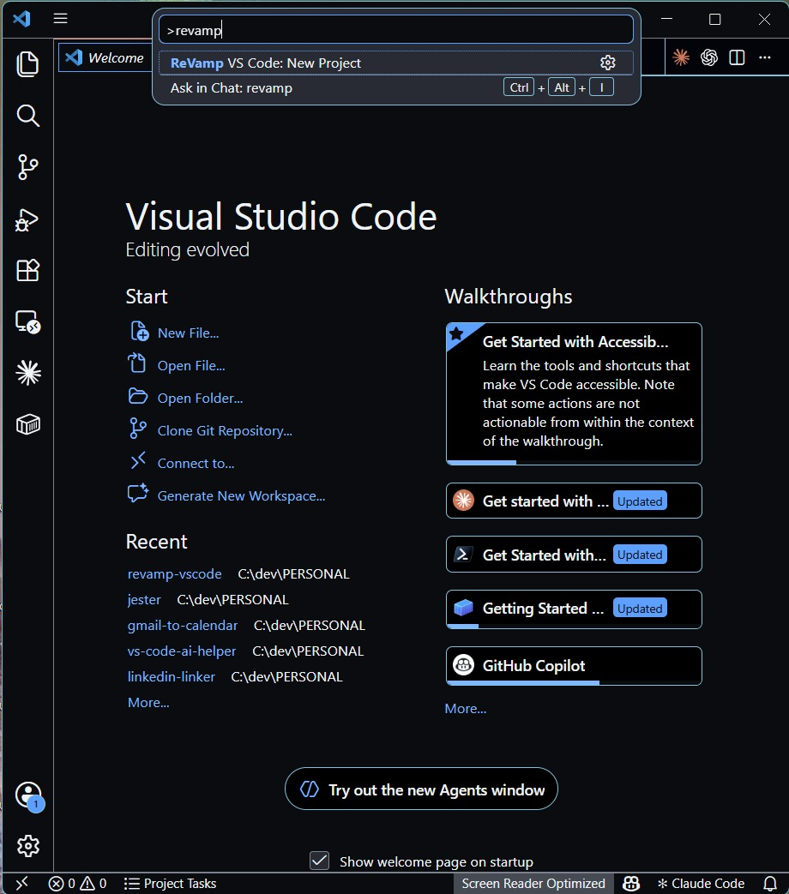
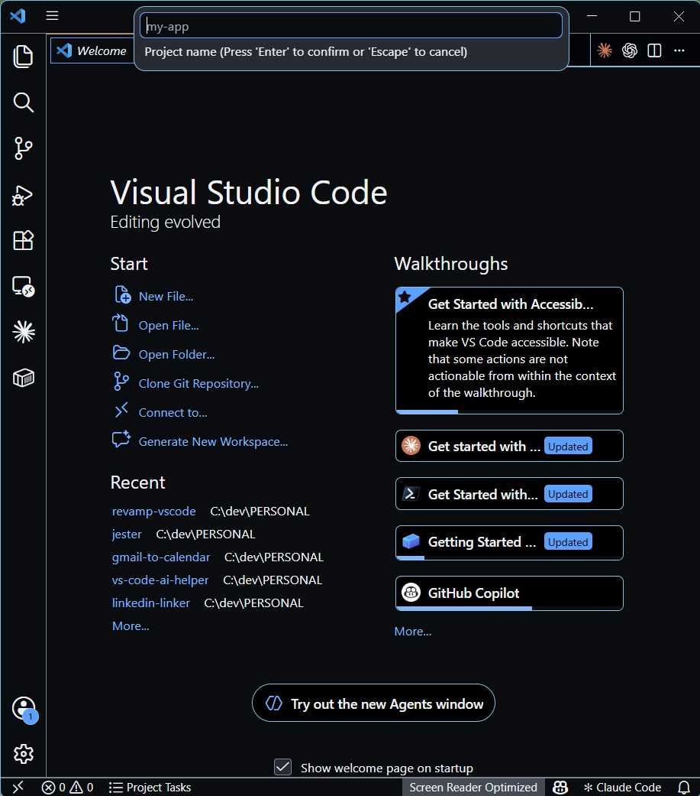
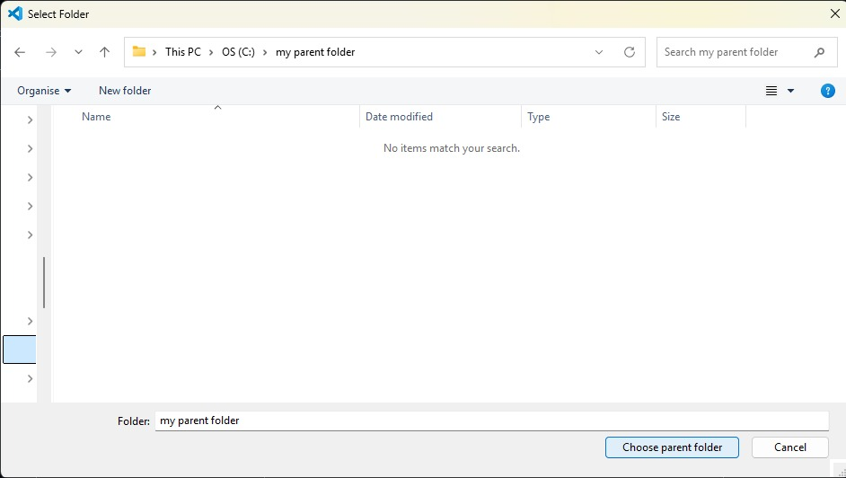
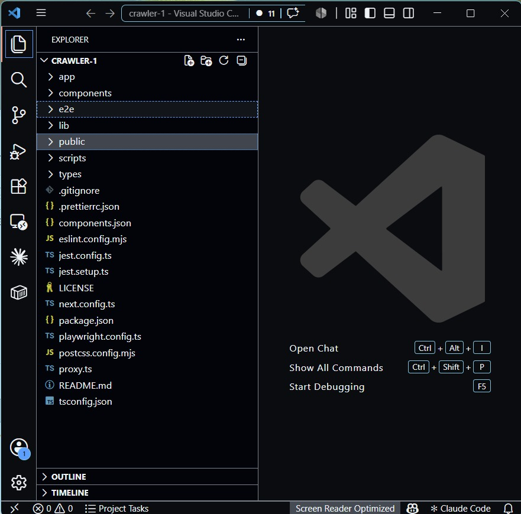

# ReVamp VS Code

Create a new [ReVamp](https://github.com/j2kenton/revamp) starter project directly from the VS Code command palette.

## What is ReVamp?

ReVamp is a Next.js starter template with TypeScript, Tailwind CSS 4, shadcn/ui, Redux, NextAuth.js, Zod, SWR, and Framer Motion.

## Screenshots

*Open the command palette and search for "revamp"*

*Type your project name and press Enter*

*Select the parent folder where the project will be created*

*The new project opens automatically in a fresh VS Code window*

## Usage

1. Open the command palette (`Ctrl+Shift+P` / `Cmd+Shift+P`)
2. Run **ReVamp VS Code: New Project**
3. Enter a project name and choose a parent folder
4. The extension creates the project from the bundled starter and opens it in a new window
5. Install dependencies in the new project before starting development

## Requirements

- [pnpm](https://pnpm.io) must be installed globally for the generated project

## License

MIT
